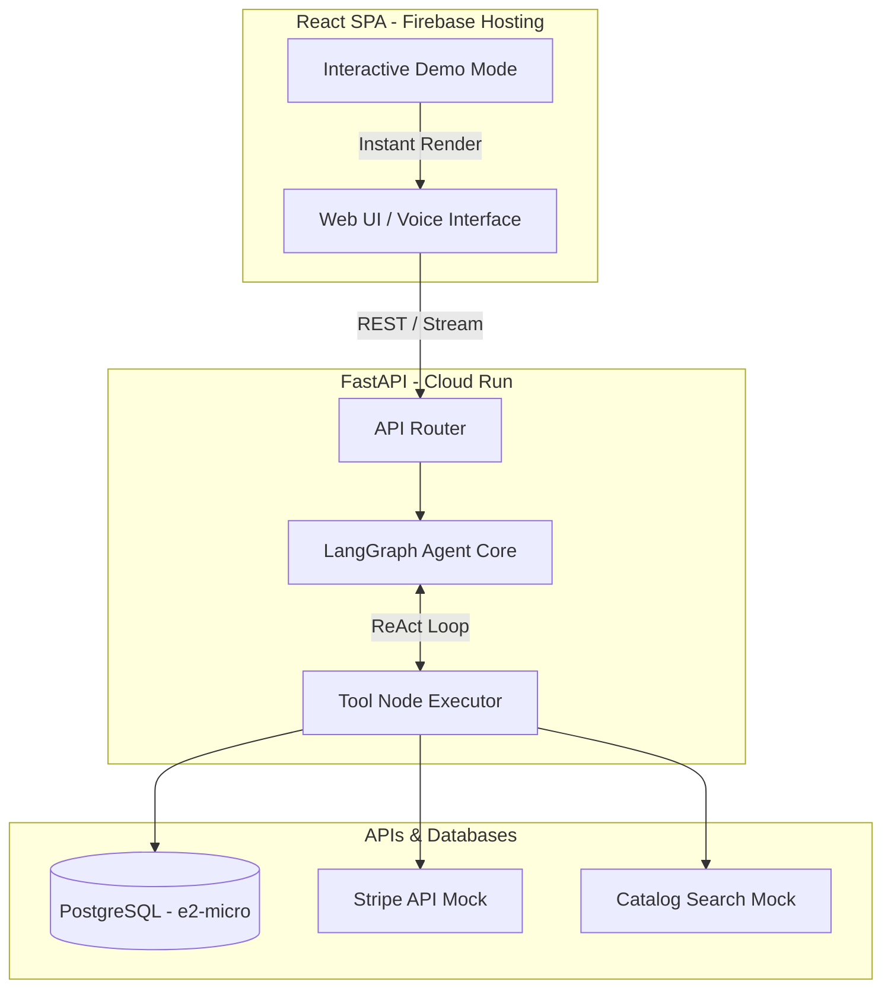

# LangGraph E-commerce Customer Support Agent 🛒🤖

[](https://github.com/BagavathyNaren/LangGraph-Ecommerce-Customer-Support-Agent/actions/workflows/e2e_staging.yml)
[](https://github.com/BagavathyNaren/LangGraph-Ecommerce-Customer-Support-Agent/actions/workflows/deploy_frontend.yml)
[](https://github.com/BagavathyNaren/LangGraph-Ecommerce-Customer-Support-Agent/actions/workflows/deploy_backend.yml)

An advanced, voice-enabled AI Customer Support Agent built with LangGraph, FastAPI, and React. Designed to handle e-commerce queries, track orders, process refunds, and search catalogs across multiple providers with a ReAct (Reasoning + Acting) loop.

---

## 🌟 Live Environments

- **Frontend (Firebase Hosting)**: [https://ecommerce-agent-f3a74.web.app](https://ecommerce-agent-f3a74.web.app)
- **Backend (GCP Cloud Run)**: *[Your Cloud Run URL (e.g. asia-south1)]*

---

## 🏗️ Architecture

The system uses a highly decoupled microservice architecture running entirely on Google Cloud Platform's Always Free tier.



## ✨ Key Features

- **LangGraph ReAct Loop**: AI dynamically decides when to use tools (search, refund, track order) vs. when to chat.
- **Voice Interactivity**: Web Speech API integration combined with Cloud TTS for an immersive "J.A.R.V.I.S" mode.
- **Interactive Demo Mode**: Instantly load a pre-recorded complex scenario with one click using the `Play` button.
- **Zero-Cost Scaling**: Backend is deployed to GCP Cloud Run with strict memory and max-instance limits to remain 100% within the free tier.
- **CI/CD Pipelines**: Automated E2E testing via Ruff and GitHub Actions, with direct deployment to Firebase and GCP upon push to `main`.

---

## 🚀 Setup Instructions

### 1. Prerequisites
- Python 3.10+
- Node.js 18+
- GCP Account & Firebase CLI

### 2. Backend Setup
```bash
cd backend
python -m venv venv
source venv/bin/activate  # On Windows: venv\Scripts\activate
pip install -r requirements.txt
python -m uvicorn main:app --reload --port 8000
```

### 3. Frontend Setup
```bash
cd frontend
npm install
npm run dev
```

### 4. Deploying
All pushes to the `main` branch are automatically deployed by GitHub Actions. Ensure you have the required secrets configured as documented in `SECRETS.md`.

---
*Built with ❤️ utilizing the latest agentic frameworks.*